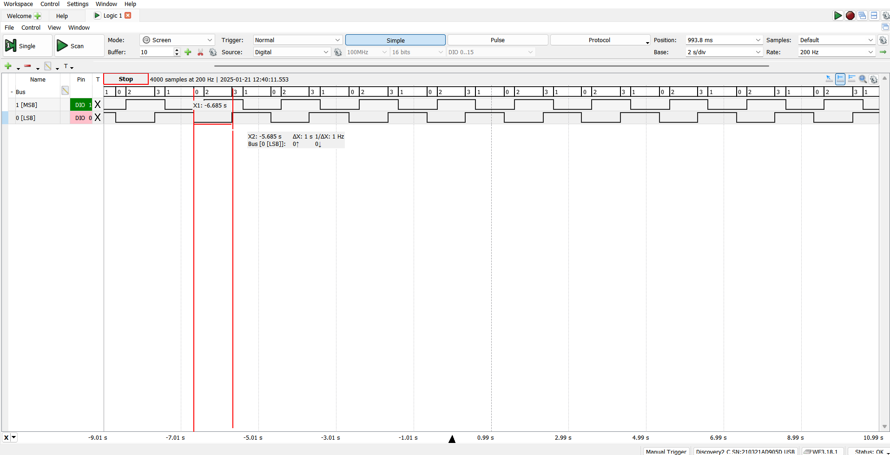
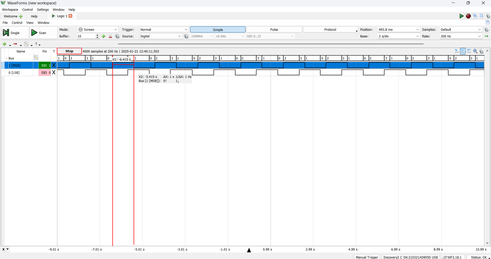

# Project 1 : Heartbeat LED

The purpose of this project was to use a delay loop and an interrupt to toggle 2 LEDs using the seperate methods.

For LED1, I used two delay loops in order to achieve a 1 second delay or a 0.5 Hz frequency. Register 15 had a value of 50000 which was decremented every clock cycle and Register 14 had an initial value of 7 which also decremented every cycle. These worked together to make a 1 second delay for LED1.

This screen capture shows that the pulsewidth of LED1 is 1 second.

LED2 utilized an interrupt to make a 0.5 Hz delay. I first used the TB0 timer and SMCLK in UP count mode and a 16-bit counter length for the clock. I then set up the compare registers by moving 32820d into the TB0CCR0 register and setting the toggling functionality in the interrupt service and vector.

This screen capture shows that the pulsewidth of LED2 is 1 second. 

